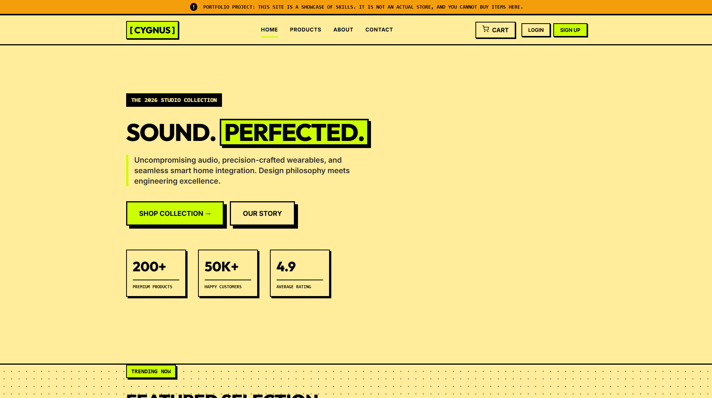

# CYGNUS - Premium Tech Store

CYGNUS is a fully functional, modern e-commerce web application featuring a striking **neo-brutalist** design aesthetic. It demonstrates full-stack capabilities with a completely custom Vanilla JavaScript Single Page Application (SPA) frontend, powered by a robust Django REST Framework backend.



## 🚀 Features

### Frontend (Vanilla JS & CSS)
- **Single Page Application (SPA)**: Custom-built JavaScript router for lightning-fast page transitions without browser reloads.
- **Neo-Brutalist Design**: Completely custom CSS featuring sharp edges, bold `#000` offset shadows, thick borders, and vibrant neon accents (no Tailwind or external libraries used).
- **Responsive Layout**: Fluid CSS Grid and Flexbox layouts that adapt perfectly to mobile, tablet, and desktop screens.
- **Dynamic Cart Management**: Real-time cart updates, quantity toggles, and total calculations.
- **Interactive Modals**: Custom-built login/registration modals and toast notifications.

### Backend (Django REST Framework)
- **RESTful API**: Clean, well-structured API endpoints for Products, Cart, Orders, and Authentication.
- **JWT Authentication**: Secure user login and session management using JSON Web Tokens.
- **Database Architecture**: SQLite database with carefully designed models for `Product`, `Order`, `Cart`, and `ContactMessage`.
- **Contact Form Email Integration**: Fully wired contact page that uses Django's SMTP backend to send actual emails to the site owner.
- **Admin Dashboard**: Built-in Django admin panel for managing inventory, viewing orders, and reading user contact messages.

## 💻 Tech Stack
- **Frontend**: HTML5, Vanilla CSS3, Vanilla JavaScript (ES6+)
- **Backend**: Python 3, Django 6.0, Django REST Framework
- **Authentication**: Simple JWT
- **Database**: SQLite (Development)

## 🛠️ Local Development Setup

To run this project locally, follow these steps:

### 1. Clone the repository
```bash
git clone https://github.com/tanmaynesty/CodeAlpha_CYGNUS.git
cd CodeAlpha_CYGNUS
```

### 2. Set up the Python Virtual Environment
```bash
python -m venv venv

# On Windows:
venv\Scripts\activate
# On Mac/Linux:
source venv/bin/activate
```

### 3. Install Backend Dependencies
```bash
pip install -r requirements.txt
```

### 4. Configure Environment Variables
You can optionally set up a `.env` file in the root directory (or inject them directly) to configure your secrets:
```env
DJANGO_SECRET_KEY=your-secret-key
DJANGO_DEBUG=True
EMAIL_HOST_USER=tanmaynesty@gmail.com
EMAIL_HOST_PASSWORD=your-google-app-password
```

### 5. Run Database Migrations
```bash
cd backend
python manage.py migrate
```

### 6. Seed the Database with Demo Products
```bash
python manage.py seed_products
```

### 7. Create a Superuser (Admin Account)
```bash
python manage.py createsuperuser
```

### 8. Start the Development Server
```bash
python manage.py runserver
```

### 9. View the App!
Open your browser and navigate to:
`http://127.0.0.1:8000/`

You can access the admin dashboard at `http://127.0.0.1:8000/admin/`.

## 📌 Disclaimer
This application was built as a portfolio project and technical showcase during the CodeAlpha Internship. It is a demonstration of full-stack development skills and is **not an actual live store** to purchase goods. 
